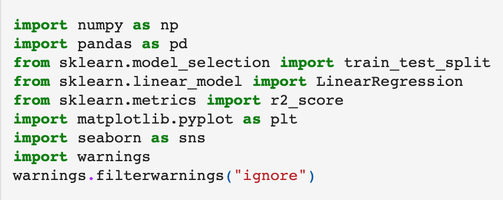

# APP NAME
The ("APP Name") serves to aid both new and veteran investors in makinging financially sound decisions when investing in the stock market. The application provides the following market data:
* Historical closing prices for selected stocks.
* Projected closing prices for selected stocks.
###### (Add image here)
#
### Interactive Controls
The app user will be able to perform the following actions:
* Purchase new securities.
* Set hold commands to hold any/all securities for a specified duration.
* Set sell commands to sell any/all owned securities at a specified date and time.
* Obtain real-time trading information on selected stocks.
###### (Add image/GIF here)
#
---
#
# Technical Requirements
###  Imported Libraries

 

*  The "warnings.filterwarnings" command removes or condesnes warning errors to ease the reading experience of the programmer.
(This code is optional)
#
### Monte Carlo Simulator
(Obtain data from assignments and teammates)

### This application is compatible with the following platforms:
* MacOS
* Windows (verify version)
* Linux (verify compatibility)
#
#
---
#
#
# How the App Works

(App Name) employs Monte Carlo and linear regression to predict future closing prices for user selected stocks. The simulation data is predicated upon historical market closing prices up to 18 months prior to the current date.
#
The Monte Carlo simulation runs 500 simulations through 18 months of historical market data. (What does this do and why is it important)?

#
#
---
#
#
# How to Use (App Name)
(App image/GIF here)

#
#
---
#
#
# Meet the Creators of (App Name)
* Jarom Lemmon (Team Lead & Core Programmer)
* Jacquelin Chavez (GUI Lead Designer)
* Jonathan Frazure (Data Acquisition & Cleaning)
* Khareem Henderson (README Developer)
