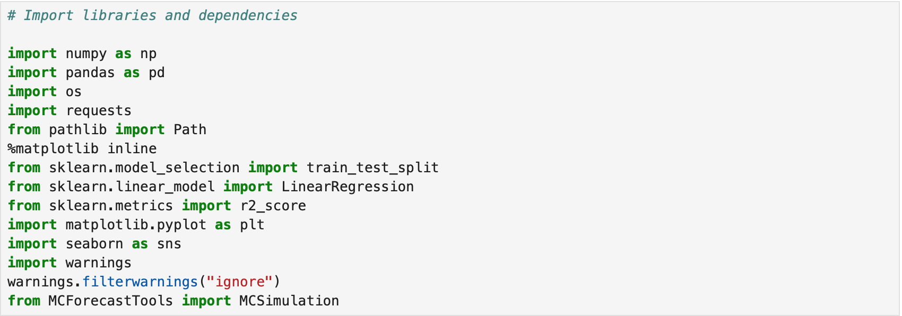
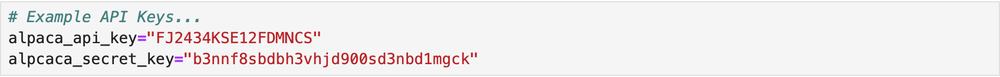
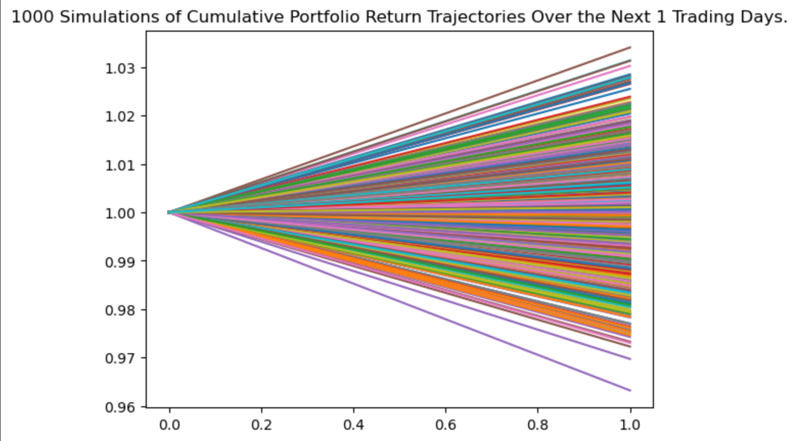
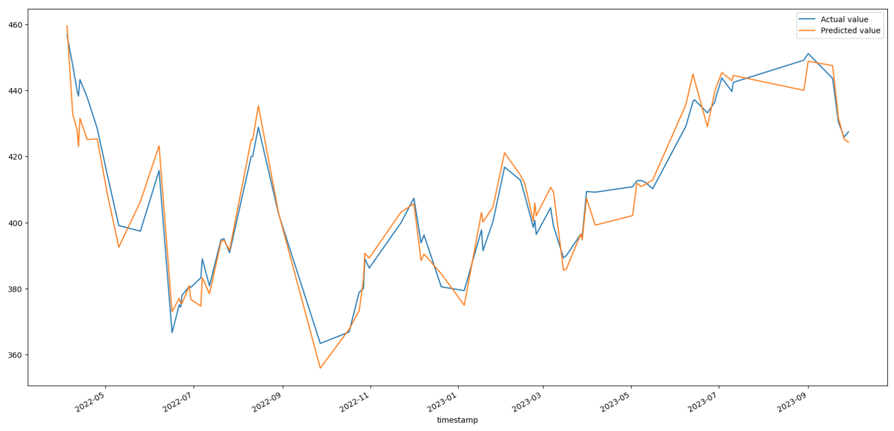

# ***SPY on Tomorrow!***
SPY on Tomorrow serves to aid both new and veteran investors in making financially sound decisions when investing in SPY (S&P 500) securities. The application provides the following market data:
* Historical closing price data (1 day prior).
* SPY (S&P 500 index ETF) predicted closing price trajectory for the next day.
###### Add GUI Image

---
#
# Technical Requirements
###  Imported Libraries

 

#

ALPCACA API Keys 

#

### *Optional Coding*

 

The "warnings.filterwarnings" command removes or condenses warning errors to ease the reading experience of the programmer.
#
### This application is compatible with the following platforms:
* MacOS
* Windows
* Linux 
#
#
---
# How the App Works
### Monte Carlo Simulator
This portion of the program simulates 1000 possible outcomes based on approximately 18 months of historical closing price market data. The app then takes the average the simulated closing prices and uses this value to accurately estimate the next day closing price for SPY.

Additionally, the app provides a low and high estimate based on the 25th and 75th percentiles respectively. 

#

### Regression Prediction
Using multi-linear regression, the app can predict the outcome of the time-series data utilized. The independent variables are world-wide regional ETFs that help predict market movement in the US by viewing the changes in the indices of other highly developed markets around the world. 

 

The accuracy score of the model is typically 95% or higher.
#
#
---
#
#
# How to Use Our App
Simply run the .exe or .py file. Once the application opens, press ***Predict Next Day*** to see the results!
#
#
---
#
#
# Meet the Creators of *SPY on Tomorrow!*
* Jarom Lemmon (*Team Lead & Core Programmer*)
* Jacquelin Chavez (*GUI Lead Designer*)
* Jonathan Frazure (*Data Acquisition & Cleaning*)
* Khareem Henderson (*README Developer*)

