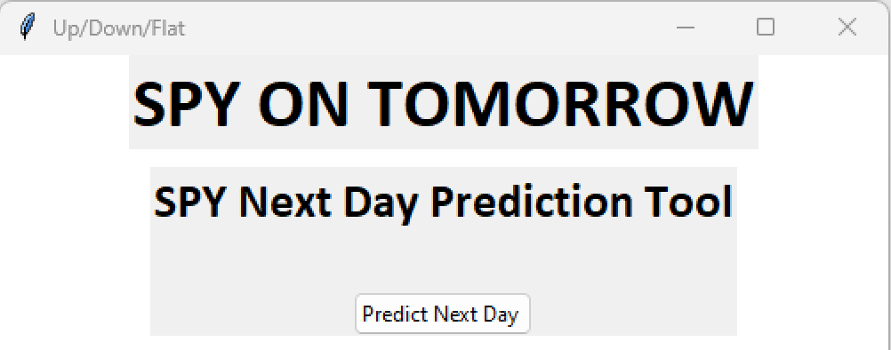
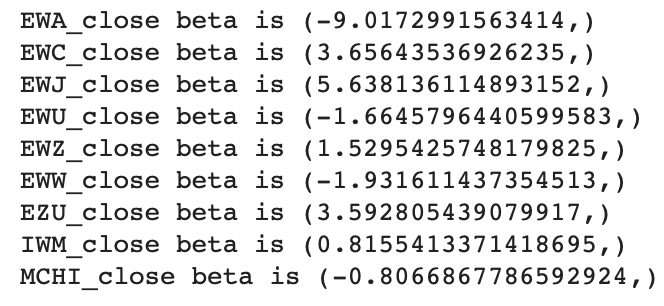
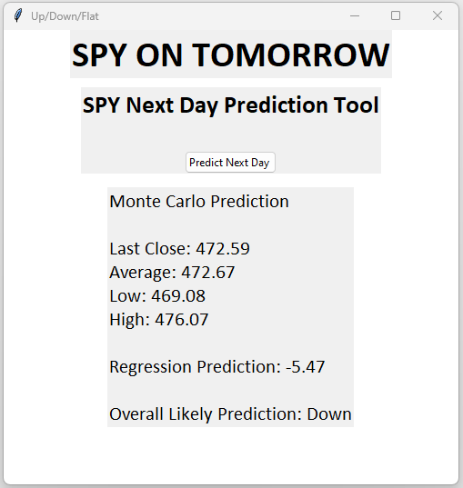

# ***SPY on Tomorrow!***

*SPY on Tomorrow* serves to aid both new and veteran investors in making financially sound decisions when investing in SPY (S&P 500) securities. The application provides the following market data:
* Historical closing price data (1 day prior).
* SPY (S&P 500 index ETF) predicted closing price trajectory for the next day.

---
#
# Technical Requirements
###  Imported Libraries

 

#

ALPCACA API Keys 

#

### *Optional Coding*

 

The "warnings.filterwarnings" command removes or condenses warning errors to ease the reading experience of the programmer.
#
### This application is compatible with the following platforms:
* MacOS
* Windows
* Linux 
#
#
---
# How the App Works
### Monte Carlo Simulator
This portion of the program simulates 1000 possible outcomes based on approximately 18 months of historical closing price market data. The app then takes the average of the simulated closing prices and uses this value to accurately estimate the next day closing price for SPY.

Additionally, low and high estimates (based on the 25th and 75th percentiles respectively) are provided. 

#

### Regression Prediction
Using multiple linear regression, the app can predict the outcome of the time-series data utilized. The independent variables are 9 world-wide regional ETFs from highly developed markets. The changes in the indices of such ETFs help predict the potential behavior of the S&P 500 index. 

The accuracy score of the model is typically 95% or higher.
#
#

### The diversity of the ETFs creates varying levels of correlation with the S&P 500 index. This provides a more robust gauge of how the US market will behave.

#
#
---
#
#
# How to Use Our App
Simply load and run the .py file. Once the application opens, press ***Predict Next Day*** to see the results!

#
#
---
#
#
# Meet the Creators of *SPY on Tomorrow!*
* Jarom Lemmon (*Team Lead & Core Programmer*)
* Jacquelin Chavez (*GUI Lead Designer*)
* Jonathan Frazure (*Data Acquisition & Cleaning*)
* Khareem Henderson (*README Developer*)

